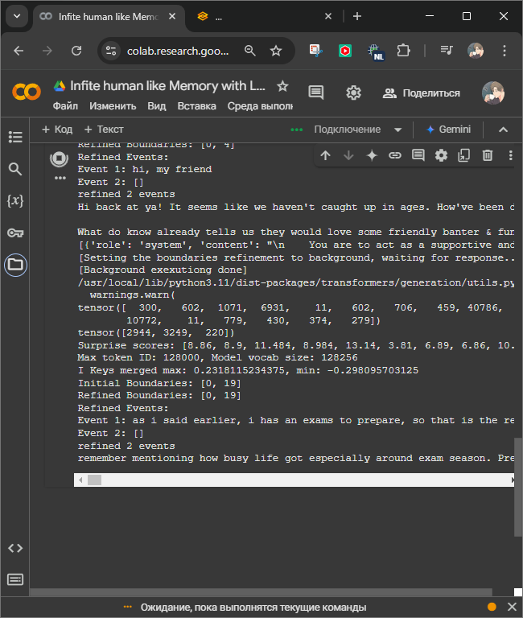
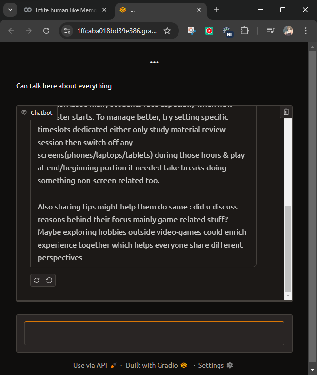
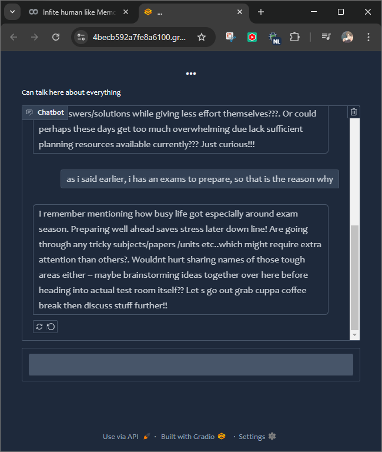

# Episodic Human-like Memory with LLM

## Introduction 

Episodic Human-like Memory with LLM is an evolving project designed to simulate human-like memory processes using large language models (LLMs). The system leverages advanced retrieval mechanisms to create a memory framework that stores and recalls episodic events. With its modular design, this project supports a variety of use cases, including conversational AI, long-term memory storage, and personalized interactions.

This repository will continue to grow with updates and improvements, integrating cutting-edge technologies in natural language processing, memory retrieval, and human-AI collaboration. By combining state-of-the-art LLMs with episodic memory models, the project aims to mimic human memory more effectively while remaining adaptable to diverse applications.

Future updates will enhance efficiency, introduce experimental features, and expand compatibility with different LLM architectures. Stay tuned as we refine and explore this fascinating intersection of memory science and artificial intelligence!


## Run and run with interface 

### Install 

```
git clone https://github.com/goin2crazy/episodic_retriaval_llm_setup
%cd /content/episodic_retriaval_llm_setup
pip install -q -r requirements.txt
```

### Run without interface

```
cd /content/episodic_retriaval_llm_setup
python run.py
```

### Run With Gradio (Comfy HF interface)

```
cd /content/episodic_retriaval_llm_setup
python run_gradio.py
```

## Config

**Data and config finetining** 

Look at the config.yaml 


 - session_type: "llm" **-> you can switch between llm and vllm (experimental)**

- model_id: "unsloth/Meta-Llama-3.1-8B-Instruct-bnb-4bit" 
- tokenizer_id: "unsloth/Meta-Llama-3.1-8B-Instruct-bnb-4bit"
**-> llm model that you will you as base, very recommended to find that one which is much comfortable for you**

- embedding_model_id: "sentence-transformers/all-MiniLM-L6-v2"
- embedding_tokenizer_id: "sentence-transformers/all-MiniLM-L6-v2"
**-> Sentence Similarity model for retrieval**

- memories_dir: "/content/drive/MyDrive/llm_memories"
**-> Directory where memories (or episodic events) will be saved** 

- batch_size: 16
**-> Batch size that defines on how much tokens calculates suprise (resommended 16-32)** 

- variance_scaling_factor: 0.6
- threshold: "None"
**-> There variables that defines how much treathold for tokens by suprise scores, you better read in the paper EM-LLM** 

- k_memmories: 20 **-> Retrieval uses the K-nearest to find relative memories (this parameter supposed to be bigger than k_top_k_memmories)** 
- k_top_k_memmories: 12 **-> the most relative memories that filtered by k_memories and sorts by time and takes newest memories, limited by this parameter** 



gradio_config:
  height: 400 
  textbox_placeholder: "want to talk with you about my day"
  textbox_container: ture 
  textbox_scale: 7
  title: " ... "  
  description: "Can talk here about everything" 
  theme: "soft" **you can explore cosy themes there https://www.gradio.app/guides/theming-guide** 
  cache_examples: true 

- share_gradio: true **-> If you run from Colab, please make sure that there true** 




## Experiment Notebook 

**Original code building and testing code there in the colab, and can be runned with GPU enabled** 
- [Episodic memory with LLM](https://colab.research.google.com/drive/17LxJkzWaW4TdaG0voJYJCOAuMcED9Mo8?usp=sharing)
- [Episidic Memory with Visual LLM](https://colab.research.google.com/drive/10QGDwLwiuUDJp4bZXOktKn-IyyxYfi04?usp=sharing)

